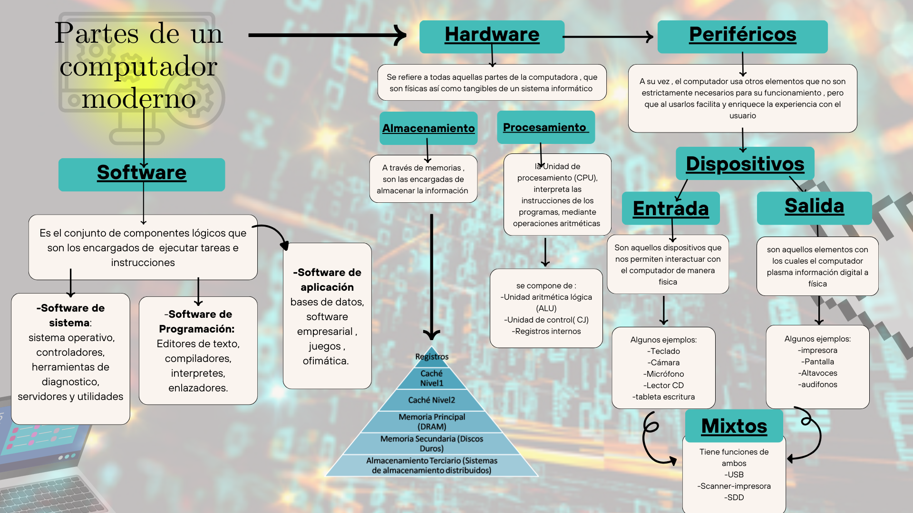
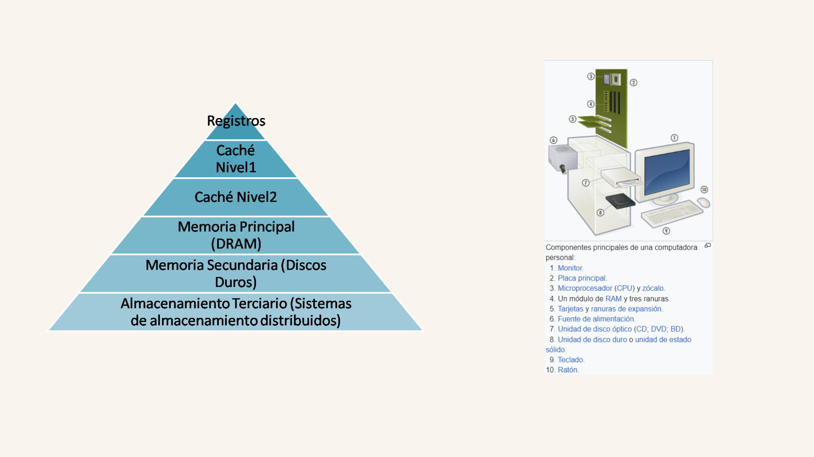
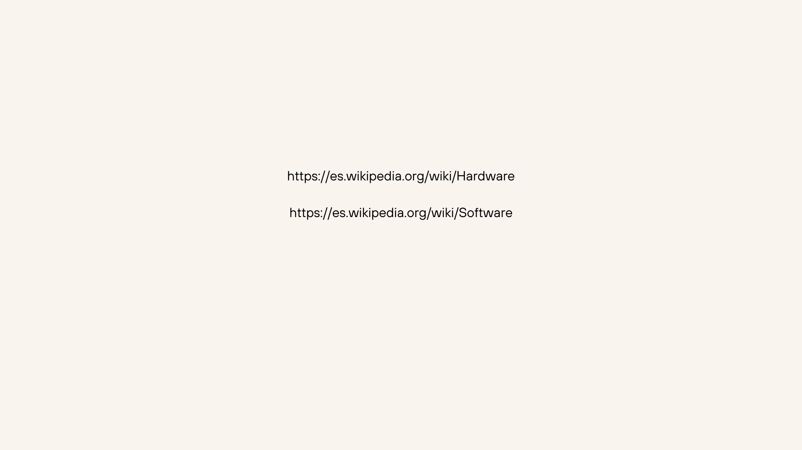

# **Partes principales de un computador moderno** 

## **Preguntas a responder**
- **1.¿Cuál es la función principal de cada componente investigado?**
Según su clasificación van a desempeñar una tarea distintita, ya que cada componente está especializado en algo especifico, pero de manera general.
El Hardware se divide en periféricos, que son los encargados de extender y facilitar la interacción con el usuario, la memoria que es la encargada de almacenar la información, y el procesamiento que se encarga de interpretar las instrucciones de los programas a través de operaciones lógicas aritméticas.

- **2.¿Cómo interactúa el hardware con el software, cuál es la función de cada uno?**
Tanto el Software como el Hardware trabajan en conjunto para un correcto funcionamiento de la máquina, a través del sistema operativo, Drivers y aplicaciones.

-  Hardware: Estos son los componentes físicos y tangibles de la máquina, entre ellos la CPU, la memoria RAM, el disco duro, la placa base, la tarjeta gráfica, etc. Su función es ejecutar las instrucciones y almacenar los datos necesarios para el funcionamiento del software.
- Software: Son aquellas cosas intangibles lógicas que se encuentran en la máquina, como los programas y sistemas operativos que controlan y coordinan el hardware para realizar tareas específicas. 

-**3.¿Cuál es la función de la CPU y cuáles son sus partes más importantes?**
La CPU (Unidad Central de Procesamiento) es un elemento que actúa como el cerebro de la máquina. Su función principal es ejecutar instrucciones de programas mediante operaciones aritméticas, lógicas, de control y de entrada/salida (I/O).
-Unidad de Control (CU): Dirige todas las operaciones de la CPU, decodificando las instrucciones y señalando a los demás componentes lo que deben hacer.

-Unidad Aritmeticológica (ALU): Realiza operaciones matemáticas y lógicas.
-Registros: Son pequeñas áreas de almacenamiento rápido dentro de la CPU que guardan datos temporales y las instrucciones que se están ejecutando.
-Caché: Memoria de alta velocidad que almacena datos e instrucciones a las que se necesita acceder rápidamente.
-Buses: Sistemas de comunicación que transfieren datos entre la CPU y otros componentes del ordenador.

- **4.¿Qué es la velocidad de la CPU, también conocida como velocidad del reloj?**
La velocidad de la CPU es aquella que determina cuántos ciclos de instrucciones puede ejecutar la CPU por segundo. Un reloj de CPU de 3 GHz, por ejemplo, puede ejecutar 3 mil millones de ciclos por segundo. Esta velocidad influye directamente en el rendimiento y la rapidez con la que la CPU puede procesar datos y ejecutar instrucciones.

- **5.¿Cuál es la secuencia de pasos que ocurre, desde el momento en que presionas el botón de encendido de la computadora, hasta que se muestra el sistema operativo listo para funcionar? Describe todos los elementos involucrados y el paso a paso.**
1. Botón de Encendido:
•	Al presionar el botón de encendido, la fuente de alimentación (PSU) envía energía eléctrica a todos los componentes del sistema.
2. POST (Power-On Self-Test):
•	La BIOS/UEFI realiza una serie de pruebas para asegurarse de que el hardware básico (memoria, teclado, discos, etc.) funciona correctamente.
3.  Cargar la BIOS/UEFI:
•	La BIOS/UEFI inicializa y configura los componentes de hardware y prepara el sistema para arrancar. Luego busca un dispositivo de arranque (disco duro, SSD, USB, etc.).
4.  Carga del Bootloader:
•	Una vez que se identifica el dispositivo de arranque, la BIOS/UEFI carga el bootloader (como GRUB para Linux o el Boot Manager de Windows) desde el dispositivo de arranque en la memoria RAM.
5.  Carga del Sistema Operativo:
•	El bootloader carga el núcleo del sistema operativo (kernel) en la memoria RAM y transfiere el control al sistema operativo.
6.  Inicialización del Sistema Operativo:
•	El sistema operativo inicializa sus componentes, carga los controladores de dispositivos y configura el entorno de usuario.
7.  Pantalla de Inicio de Sesión:
•	Una vez que el sistema operativo está completamente cargado y configurado, muestra la pantalla de inicio de sesión o el escritorio, listo para que el usuario comience a utilizar la computadora.

-**6.Comenta algo que no sabías y que descubriste en esta actividad**
A pesar de estar cursando nuevamente la materia, hay cosas que desconocía, como lo es la velocidad reloj, conocer esto , nos ayuda a desarrollar mejores componentes , así mismo el saber que comprar a la hora de armar un computador a base de componentes; así mismo había partes en el proceso de encendido de una computadora que desconocía.

### ***Bibliografias***

